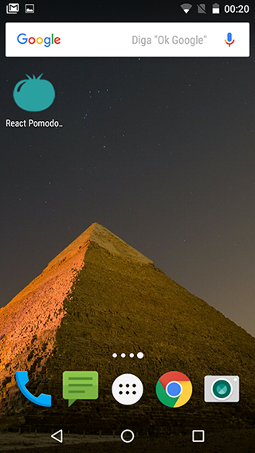
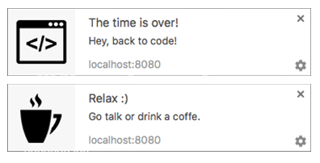

# [React devtime](http://vpdeva.github.io/react-devtime/)

[](https://travis-ci.org/vpdeva/react-devtime)
[](https://github.com/vpdeva/react-devtime/archive/0.4.1.zip)
[](https://david-dm.org/vpdeva/react-devtime)
[](https://david-dm.org/vpdeva/react-devtime#info=devDependencies)

> devtime timer for developers.



## Features

- **Add to homescreen**
- **Offline support**
- **Times available:**
  - Timer for code - 25min
  - Timer for social - 5min
  - Timer for Coffee - 15min
- **Time display:**
  - Page display
  - Title display <br><br>
  
- **Alarms available:**
  - Web Notifications <br>
  
  - Vibration
  - Songs
- **Basic controls:**
  - Play button
  - Pause button
- **Keyboard Shortcuts**
  - Space: Play
  - Ctrl/Command + Left: Toggle mode
  - Ctrl/Command + Right: Toggle mode

## Versioning

To keep better organization of releases we follow the [Semantic Versioning 2.0.0](http://semver.org/) guidelines.

## Run the project locally

**1 -** Prepare the environment:

```sh
$ npm install -g webpack
```

**2 -** Clone the project and install the dependencies:

```sh
$ git clone https://github.com/vpdeva/react-devtime.git
$ cd react-devtime
$ npm install
```
**3 -** Run webpack and webpack-dev-server:

```sh
$ npm start
```

Go to: [localhost:8080](http://localhost:8080/)

## Tasks available

- `$ npm start` - Run webpack and webpack-dev-server
- `$ npm run lint` - ESlint :D
- `$ npm run test` - Run mocha tests
- `$ npm run build` - Generates the bundle.js
- `$ npm run deploy` - Push for gh-pages


## Contributing
Find on our [issues](https://github.com/vpdeva/react-devtime/issues/) the next steps of the project ;)
<br>
Want to contribute? [Follow these recommendations](https://github.com/vpdeva/react-devtime/blob/master/CONTRIBUTING.md).

## History
See [Releases](https://github.com/vpdeva/react-devtime/releases) for detailed changelog.

## License
[MIT License](https://github.com/vpdeva/react-devtime/blob/master/LICENSE.md) © [Afonso Pacifer](http://vpdeva.com/)
